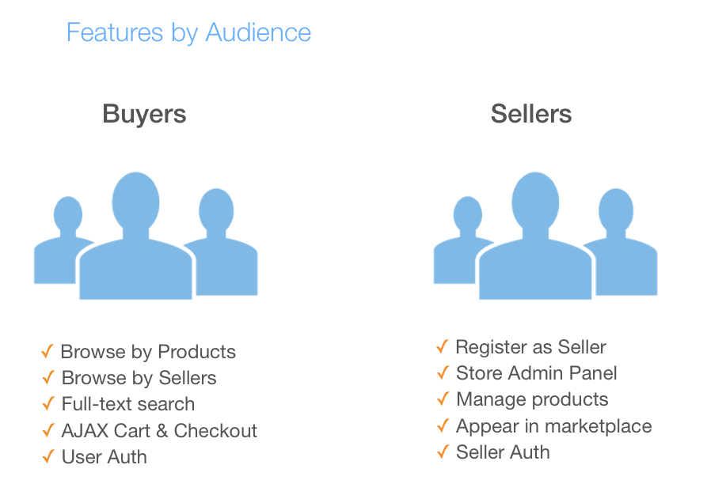
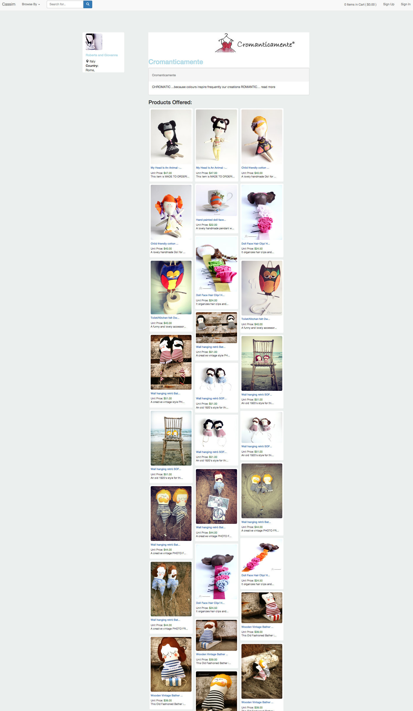
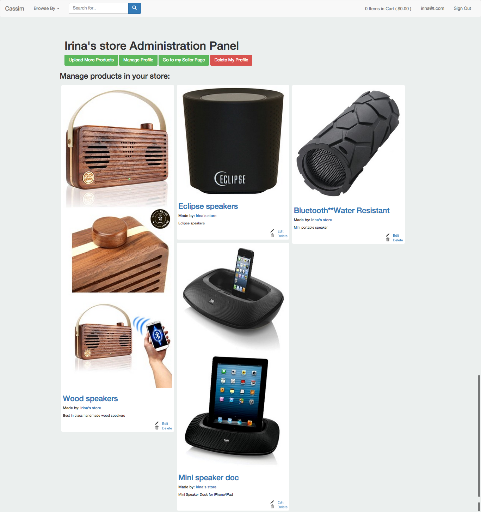

== README

Find deployed here: http://www.cassim.co/
Cassim app is an Etsy-like marketplace where buyers and sellers can discover products sold worldwide.

Technical stack: Ruby on Rails 4, PostgreSQL, Elasticsearch (full-text search), Ruby bindings for Selenium Webscraper (Etsy content scraping), Masonry UI.

Currently under development:
- Stripe API integration
- AJAX content fetching for faster site load speed
- Content tagging

To clone & run:

* Ruby 2.2.0

* Rails 4.1.8

* Database creation: rake db:drop db:create db:migrate rake etsy:scrape

* Rspec unit & feature tests in /spec directory

Screenshots:

(a) Features by audience

(b) Browse by products

(c) Browse by sellers

(d) Seller store

(e) Seller admin dashboard

